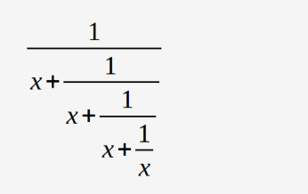

# Objectives

- Become familiar with inputting and outputting data in Python
- Evaluate simple expressions

---

## Scenario

Your task is to complete the code in order to evaluate the results of four basic arithmetic operations.

```python
# input a float value for variable a here
# input a float value for variable b here

# output the result of addition here
# output the result of subtraction here
# output the result of multiplication here
# output the result of division here

print("\nThat's all, folks!")
```

The results have to be printed to the console.

You may not be able to protect the code from a user who wants to divide by zero. That's okay, don't worry about it for now.

Test your code – does it produce the results you expect?

We won't show you any test data – that would

# Objectives 2

- Become familiar with the concept of numbers, operators, and arithmetic operations in Python.
- Understand the precedence and associativity of Python operators, as well as the proper use of parentheses.

---

## Scenario 2

Your task is to complete the code in order to evaluate the following expression:



The result should be assigned to `y`. Be careful—watch the operators and keep their priorities in mind. Don't hesitate to use as many parentheses as you need.

You can use additional variables to shorten the expression (but it's not necessary). Test your code carefully.

---

## Test Data

**Sample input:**  
```
1
```
**Expected output:**  
```
y = 0.6000000000000001
```

**Sample input:**  
```
10
```
**Expected output:**  
```
y = 0.09901951266867294
```

**Sample input:**  
```
100
```
**Expected output:**  
```
y = 0.009999000199950014
```

**Sample input:**  
```
-5
```
**Expected output:**  
```
y = -0.19258202567760344
```

# Objectives 3

- Improve the ability to use numbers, operators, and arithmetic operations in Python
- Use the `print()` function's formatting capabilities
- Learn to express everyday-life phenomena in terms of programming language

---

## Scenario 3

Your task is to prepare a simple code able to evaluate the end time of a period of time, given as a number of minutes (it could be arbitrarily large). The start time is given as a pair of hours (`0..23`) and minutes (`0..59`). The result has to be printed to the console.

```python
hour = int(input("Starting time (hours): "))
mins = int(input("Starting time (minutes): "))
dura = int(input("Event duration (minutes): "))

# Write your code here.
```

For example, if an event starts at 12:17 and lasts 59 minutes, it will end at 13:16.

Don't worry about any imperfections in your code—it's okay if it accepts an invalid time. The most important thing is that the code produces valid results for valid input data.

Test your code carefully.  
**Hint:** using the `%` operator may be the key to success.

---

## Test Data

**Sample input:**
```
12
17
59
```
**Expected output:**
```
13:16
```

**Sample input:**
```
23
58
642
```
**Expected output:**
```
10:40
```

**Sample input:**
```
0
1
2939
```
**Expected output:**
```
1:0
```